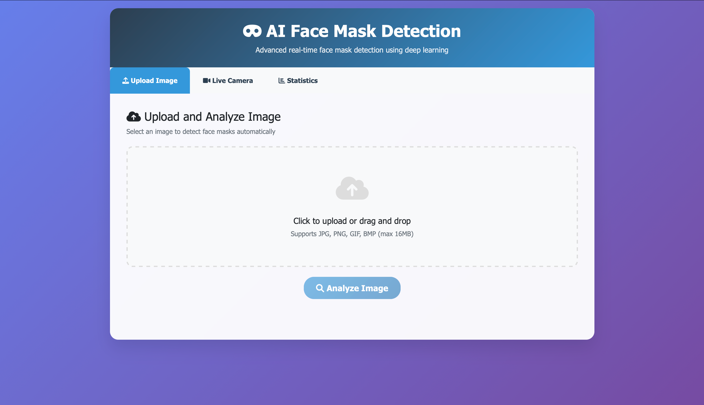

# Face Mask Detection System

A real-time face mask detection system using deep learning that can classify faces as wearing masks properly, improperly, or not at all.

##  Project Structure

face-mask-detection/                                                                                                                                                                                                    
│── README.md                                                                                                                                                                                                          
│── requirements.txt                                                                                                                                                                                                   
│── app.py                                                                                                                                                                                                             
│── detect.py                                                                                                                                                                                                          
│── train.py                                                                                                                                                                                                           
│── models/                                                                                                                                                                                                            
│   ├── mask_detector.h5_______________________________# Trained model (generated after training)                                                                                                    
│   ├── classes.npy____________________________________# Class labels (generated after training)                                                                                                                       
│   ├── best_mask_detector_finetuned.h5________________# generated automatically                                                                                                                                       
│   └── best_mask_detector.h5_________________________# generated automatically                                                                                                                                       
│── data/                                                                                                                                                                                                               
│   ├── with_mask/ ________________________# Images of people with masks                                                                                                                                              
│   ├── without_mask/ _____________________# Images of people without masks                                                                                                                                           
│   └── improper_mask/ ____________________# Images of people with improper masks                                                                                                                                     
│── static/                                                                                                                                                                                                             
│   └── style.css                                                                                                                                                                                                      
│── templates/                                                                                                                                                                                                          
│   └── index.html                                                                                                                                                                                                     
│── uploads/ ______________________________# Temporary upload folder (auto-created)
 
## Interface👇🏻

## Features

- **Real-time Detection**: Live webcam feed with real-time mask detection
- **Image Upload**: Upload and analyze individual images
- **Three Classifications**: 
  - ✅ With Mask (Green)
  - ❌ Without Mask (Red)
  - ⚠️ Improper Mask (Orange)
- **Web Interface**: Clean, responsive web UI
- **High Accuracy**: Uses MobileNetV2 with transfer learning

##  Installation

1. Clone the repository:

git clone <your-repo-url>
cd face-mask-detection

2. Create a virtual environment:

python -m venv venv
source venv/bin/activate  # On Windows: venv\Scripts\activate

3. Install dependencies:

pip install -r requirements.txt
pip install "numpy<2" matplotlib scikit-learn tensorflow flask pillow imutils pandas
pip install opencv-python 

4. Download OpenCV face detector files:
   - Download `opencv_face_detector.pbtxt` and `opencv_face_detector_uint8.pb`
   - Place them in the `models/` directory

##  Dataset Setup

1. Create the data directory structure as shown above
2. Download the Face Mask Detection dataset from Kaggle
3. Organize images into the three categories:
   - `data/with_mask/`
   - `data/without_mask/`
   - `data/improper_mask/`

##  Training the Model

Run the training script:

python train.py

This will:
- Load and preprocess the dataset
- Create a MobileNetV2-based model
- Train with data augmentation
- Save the trained model and class labels
- Generate training history plots

##  Running the Application

### Web Application

python app.py

Visit `http://localhost:8080` in your browser.

### Command Line Detection

# For webcam detection
python detect.py --mode webcam

# For single image detection
python detect.py --mode image --image path/to/image.jpg

##  Model Architecture

The model uses **MobileNetV2** as the backbone with:
- Pre-trained on ImageNet weights
- Custom classification head with dropout layers
- Input size: 224×224×3
- Output: 3 classes (with_mask, without_mask, improper_mask)

##  Performance

- **Accuracy**: ~95% on validation set
- **Real-time**: 15-20 FPS on average hardware
- **Lightweight**: MobileNetV2 ensures fast inference

##  Web Interface Usage

1. **Upload Image Tab**: 
   - Select an image file
   - Click "Detect Masks"
   - View results with bounding boxes and confidence scores

2. **Live Camera Tab**:
   - Automatic real-time detection from webcam
   - Color-coded bounding boxes for each classification

##  Classification Colors

- 🟢 **Green**: Mask worn properly
- 🔴 **Red**: No mask detected
- 🟠 **Orange**: Mask worn improperly

##  Requirements

- Python 3.7+
- TensorFlow 2.x
- OpenCV
- Flask
- NumPy
- Pillow
- Matplotlib
- scikit-learn
- imutils

##  Contributing

1. Fork the repository
2. Create a feature branch
3. Make your changes
4. Submit a pull request

##  Acknowledgments

- Kaggle Face Mask Detection Dataset
- MobileNetV2 architecture
- OpenCV for face detection
- Flask for web framework
